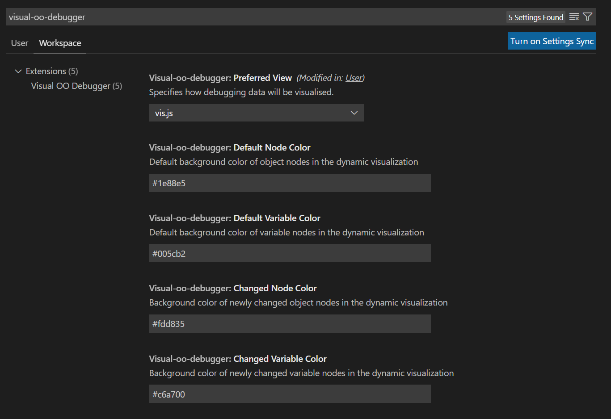

# Visual OO Debugger

A VS Code extension for visualizing debug information.

## Supported Languages

This extension was initially created with support for Java only.

## Usage

### Installation and Basic Use

After installing the extension from [VS Marketplace](https://marketplace.visualstudio.com/items?itemName=GinoCardilloOST.visual-oo-debugger), execute the command `VOOD: Open debugger view` to open a new view for the visualization. Then execute your code in debug mode and continue the program step-by-step and see the visualization update in the debugger view.

### Exporting a PNG

Simply execute the command `VOOD: Export as PNG` to create a PNG of the current state of the visualization.

### Recording a GIF

To start recording a GIF, use the command `VOOD: Start recording a GIF`. To end the recording, use the command `VOOD: Stop recording a GIF`. For quicker use, create a key-mapping for those commands.
After ending the recording, the footage will be converted into a GIF. This process might take some time, so we recommend keeping the recording as long as necessary and as short as possible.

### Exporting a PlantUML file

Simply execute the command `VOOD: Export as PlantUML` to create a PlantUML file of the current state of the visualization
or click on the `Visual Debugger` panel menu item `Export as PlantUML` instead.

### Back-Stepper

Use the buttons in the top left hand corner of the view to load the previous or next state of the visualization. Note that this will only change the state of the visualization and is not a way to step back/forward in the debugger. Only states that have been visualized before may be loaded that way.

## Extension Settings

By default, [vis.js](https://visjs.org/) is used to visualize the debug information. The preferred view can be changed in the User/Workspace Settings:

